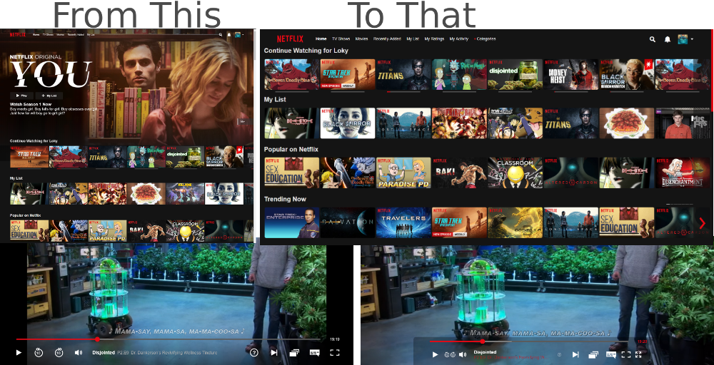
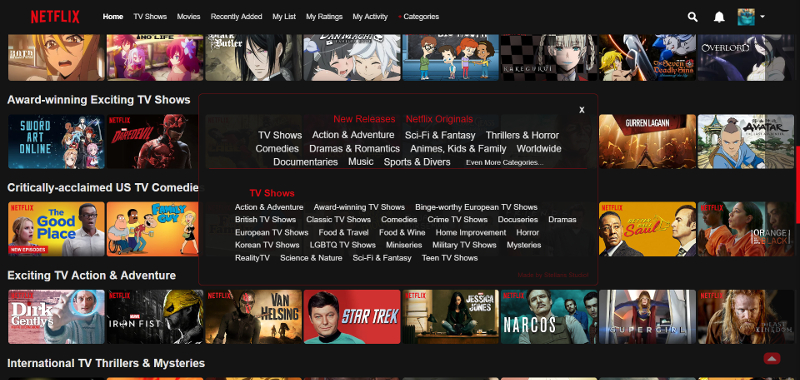

# Netflix-Expanded
Some Netflix Userscripts for [Tampermonkey](https://tampermonkey.net/) !!

  

#### What is Tampermonker?
Tampermonkey is an userscript manager, available for Chrome, Firefox, Safari, Opera Next, and even Edge.

### Installation
1. Install the extension [Tampermonkey](https://tampermonkey.net/)!
1. Select a script that you wish to use and click on its name down below.
1. The script will be automatically opened by Tampermonkey.
1. Click on the _Install_ button.
1. Voila!

## Scripts
### > [netflix-skip-intro.user.js](https://raw.githubusercontent.com/StellarisStudio/Netflix-Expanded/master/netflix-skip-intro.user.js)
Automatically click the netflix "Skip intro" button when it appears.

### > [netflix-expanded.user.js](https://raw.githubusercontent.com/StellarisStudio/Netflix-Expanded/master/netflix-expanded.user.js)
More visible content, Remove the billboard promotions and Disable Mouseover Trailers Auto-Preview, Add a "Go Top" Button, Centered player controls, Better Subtitles, Stretch video by default (remove black side) and add a button to control it!!  

### > [netflix-more-categories.user.js](https://raw.githubusercontent.com/StellarisStudio/Netflix-Expanded/master/netflix-more-categories.user.js)
Add new menu entry to the main menu, "My Rankings", "My history" and a new menu with a lot of hidden categories!  

